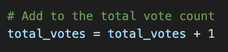
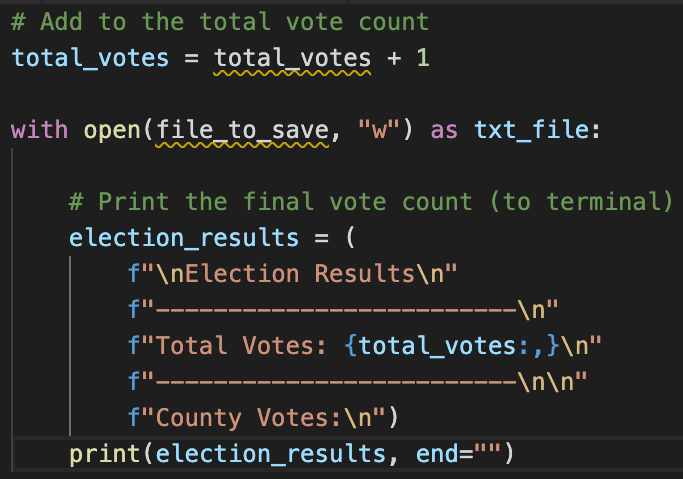
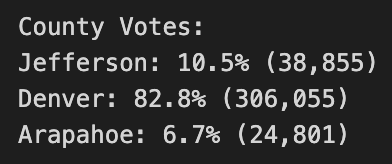
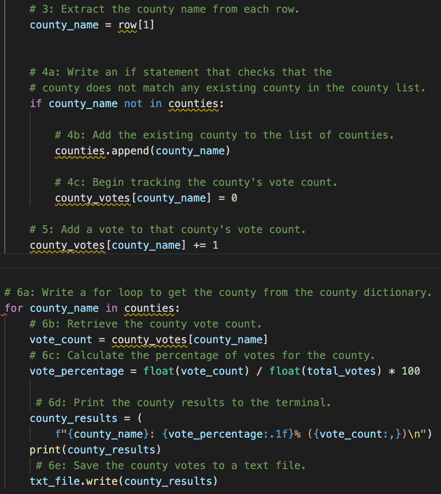
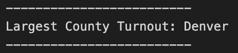
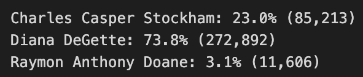
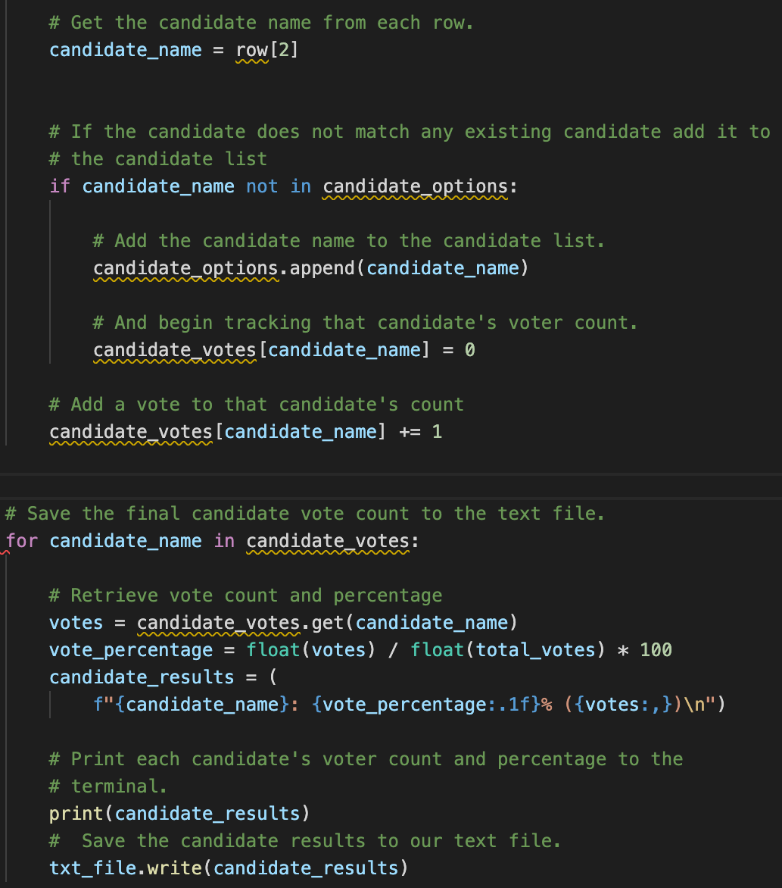
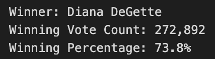
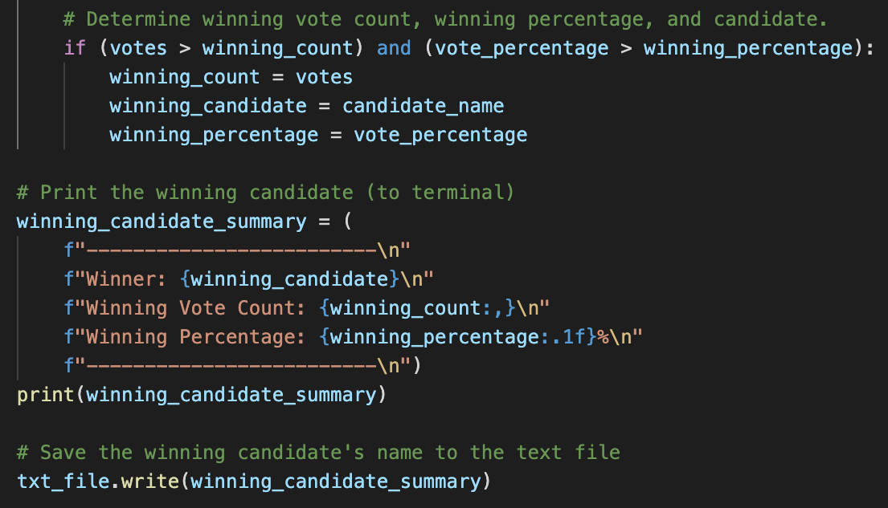
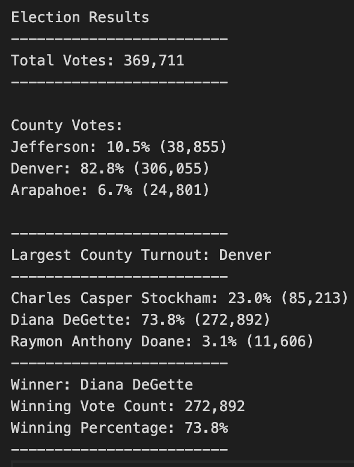

# Election Audit

## Overview

### Purpose
The purpose of this audit was to create a Python script that would pull information from a dataset containing congressional election results.

## Results
The following election outcomes were addressed, and the related codes are provided next to each outcome:
- **Total votes cast:**

    

    

- **Breakdown of votes and percentage of total votes for each county:**

    

    

- **County with largest votes:**

    

    

- **Breakdown of votes and percentage of total votes for each candidate:**

    

    

- **Candidate winner:**

    

    
    
## Summary
As exampled below, this script allows an analysis of election outcomes and provides easy-to-read results in a text file.

Ultimately, this script can be used for any election with a few modifications.

### Potential Script Modifications
-  If we wanted to add ballot measures, we would modify the script to include both a list and dictionary of ballot measures and their votes. The code would be similar to that of the county and candidate breakdown codes above and would be placed in the same area in the script.
- If we wanted to show the vote count and percentage every candidate received in each county, we could add the key "candidate name" to each county's dictionary.