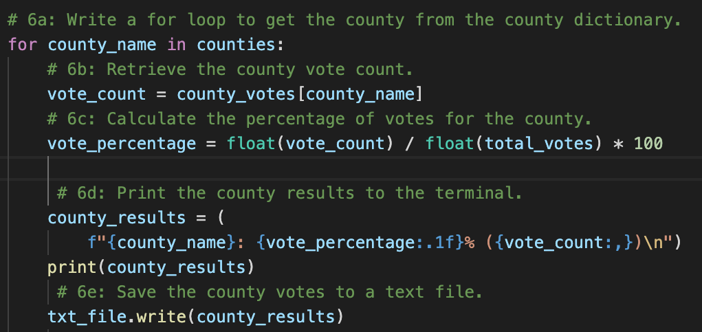

# Election Audit

## Overview Election Audit

### Purpose
The purpose of this audit was to create a Python script that will pull information from a dataset containing election results.

## Election Audit Results
The following election outcomes were addressed with the corresponding code provided below the outcome:
    - <b>Total votes cast:</b> 369,711

    
    

    - <b>Breakdown of votes and percentage of total for each county:</b>

    
    

## Election Audit Summary

### Potential Modifications for Other Elections