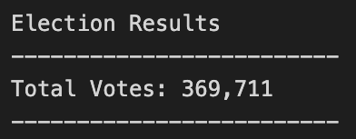

# Election Audit

## Overview Election Audit

### Purpose
The purpose of this audit was to create a Python script that will pull information from a dataset containing election results.

## Election Audit Results
The following election outcomes were addressed, and the related codes are provided below each outcome:
- **Total votes cast:**

    
    

- **Breakdown of votes and percentage of total votes for each county:**

    
    

- **County with largest votes:**

    
    

- **Breakdown of votes and percentage of total votes for each candidate:**

    
    

- **Candidate winner:**

    
    

## Election Audit Summary

### Potential Modifications for Other Elections